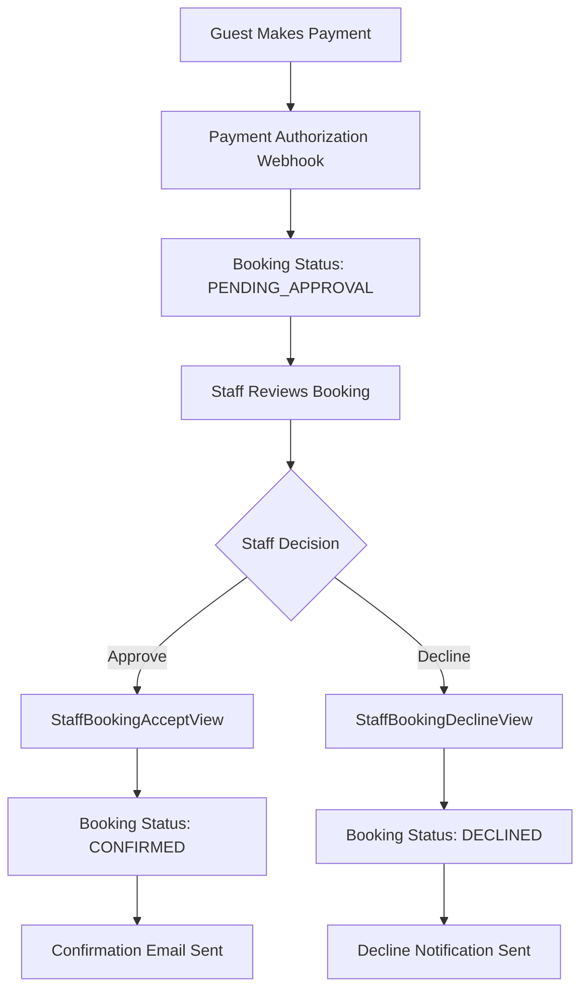
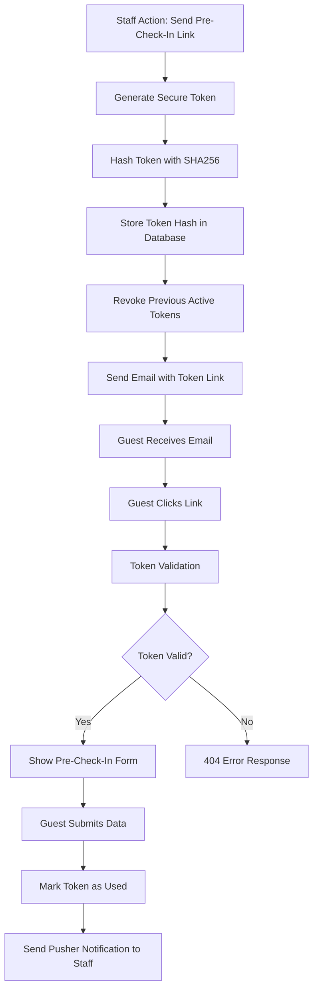

# Guest Token Handling and Email Confirmation System

This document explains how HotelMate handles guest tokens for booking access and sends confirmation emails throughout the booking lifecycle.

## Table of Contents
- [Guest Token System Architecture](#guest-token-system-architecture)
- [Token Generation and Management](#token-generation-and-management)
- [Guest API Endpoints](#guest-api-endpoints-and-authentication)
- [Email Confirmation System](#email-confirmation-system)
- [Email Workflows and Triggers](#email-workflows-and-triggers)
- [Security Measures](#security-measures-and-token-scope)
- [Integration Points](#integration-with-precheckin-system)

## Guest Token System Architecture

### BookingPrecheckinToken Model
**Location**: `api/booking/models.py`

The system uses a secure token-based authentication model that provides temporary guest access to booking information without requiring account creation.

```python
class BookingPrecheckinToken(models.Model):
    booking = models.ForeignKey(RoomBooking, on_delete=models.CASCADE, related_name='precheckin_tokens')
    token_hash = models.CharField(max_length=64)  # SHA256 hash only - raw token never stored
    expires_at = models.DateTimeField()  # 72-hour expiration window
    used_at = models.DateTimeField(null=True, blank=True)  # One-time use tracking
    revoked_at = models.DateTimeField(null=True, blank=True)  # Manual revocation
    created_at = models.DateTimeField(auto_now_add=True)
    sent_to_email = models.EmailField(blank=True)  # Audit trail for email delivery
    config_snapshot_enabled = models.JSONField(default=dict, blank=True)  # Hotel config at token creation
    config_snapshot_required = models.JSONField(default=dict, blank=True)  # Required fields snapshot
```

### Key Security Features

1. **SHA256 Hashing**: Raw tokens are never stored in the database - only SHA256 hashes
2. **72-Hour Expiration**: All tokens automatically expire after 72 hours
3. **One-Time Use**: Tokens are marked as used after successful form submission
4. **Token Revocation**: Previous active tokens are automatically revoked when new ones are created
5. **Constant-Time Validation**: Uses secure comparison methods to prevent timing attacks

## Token Generation and Management

### Staff-Initiated Token Creation
**Endpoint**: `POST /api/staff/hotel/{hotel_slug}/room-bookings/{booking_id}/send-precheckin-link/`
**View Class**: `StaffBookingSendPrecheckinLinkView`
**Location**: `api/booking/views.py`

#### Token Generation Process:

1. **Staff Authentication**: Staff member must be authenticated and have hotel access permissions
2. **Secure Token Generation**: System generates cryptographically secure token using `secrets.token_urlsafe(32)`
3. **Token Hashing**: Raw token is hashed with SHA256 before database storage
4. **Token Revocation**: Any previous active tokens for the same booking are automatically revoked
5. **Email Delivery**: Guest receives email with pre-check-in link containing the raw token
6. **Configuration Snapshot**: Hotel's pre-check-in requirements are captured at token creation time

```python
# Token generation example workflow
raw_token = secrets.token_urlsafe(32)  # Cryptographically secure
token_hash = hashlib.sha256(raw_token.encode()).hexdigest()  # Hash for storage
expires_at = timezone.now() + timedelta(hours=72)  # 72-hour expiration
```

### Token Lifecycle States

| State | Description | Database Fields |
|-------|-------------|----------------|
| **Active** | Token is valid and unused | `used_at=NULL`, `revoked_at=NULL`, `expires_at > now()` |
| **Used** | Token successfully submitted | `used_at != NULL` |
| **Revoked** | Token manually invalidated | `revoked_at != NULL` |
| **Expired** | Token past expiration time | `expires_at < now()` |

## Guest API Endpoints and Authentication

### Token Validation Endpoint
**Route**: `GET /api/public/hotel/{hotel_slug}/precheckin/validate/{token}/`
**View Class**: `PublicPrecheckinValidateView`
**Authentication**: Token-based (no user authentication required)

#### Security Model:
- **Unified 404 Responses**: All invalid token states return identical 404 responses
- **No Information Leakage**: Booking details are only revealed for valid, active tokens
- **Constant-Time Comparison**: Token hash validation uses secure comparison methods
- **Rate Limiting**: 10 requests per minute per IP address

#### Successful Response Structure:
```json
{
    "booking": {
        "id": "BK-2025-0001",
        "check_in": "2025-12-20",
        "check_out": "2025-12-22",
        "room_type_name": "Standard Double",
        "hotel_name": "Example Hotel",
        "nights": 2,
        "expected_guests": 2
    },
    "party": {
        "primary": {
            "id": 123,
            "first_name": "John",
            "last_name": "Doe",
            "role": "PRIMARY"
        },
        "companions": [],
        "total_count": 1
    },
    "party_complete": false,
    "precheckin_config": {
        "enabled_fields": ["nationality", "phone"],
        "required_fields": ["nationality"]
    }
}
```

### Data Submission Endpoint
**Route**: `POST /api/public/hotel/{hotel_slug}/precheckin/submit/`
**View Class**: `PublicPrecheckinSubmitView`

#### Features:
- **Atomic Transactions**: Database operations are wrapped in atomic transactions
- **One-Time Use**: Token is marked as used (`used_at` timestamp) after successful submission
- **Real-Time Updates**: Pusher notifications sent to staff for live booking updates
- **Validation**: All submitted data validated against configuration snapshot requirements

## Email Confirmation System

### Multiple Email Services
The system provides several specialized email services for different booking lifecycle events:

#### A. Booking Confirmation Emails
**Location**: `api/booking/email_services.py`
**Service Class**: `BookingConfirmationEmailService`

- **Trigger**: When staff confirms a booking via `StaffBookingAcceptView`
- **Template**: Professional HTML email with complete booking details
- **Subject**: `"Booking Confirmed - {hotel_name} - {booking_id}"`
- **Content**: Check-in/out dates, room details, guest count, hotel contact information

#### B. Pre-Check-in Link Emails
**Location**: `api/booking/services.py`
**Service Method**: `send_precheckin_email_to_guest()`

**Email Template Structure**:
```
Subject: Complete your check-in details - {hotel_name}

Dear {guest_name},

Please complete your party details before your stay at {hotel_name}.

Booking Details:
- Booking ID: {booking_id}
- Check-in: {check_in_date}
- Check-out: {check_out_date}
- Room: {room_type_name}

Complete your details here: {precheckin_url}

Important: This link expires in 72 hours.

Best regards,
{hotel_name} Team
```

#### C. Alternative Booking Confirmation
**Location**: `api/booking/services.py`
**Service**: `send_booking_confirmation_email()` (alternative implementation)
**Format**: Plain text email with essential booking information

### Email Configuration
**Location**: `hotelmate_backend/settings.py`

```python
EMAIL_BACKEND = 'django.core.mail.backends.smtp.EmailBackend'
EMAIL_HOST = 'smtp.gmail.com'
EMAIL_PORT = 587
EMAIL_USE_TLS = True
EMAIL_HOST_USER = env('EMAIL_HOST_USER')
EMAIL_HOST_PASSWORD = env('EMAIL_HOST_PASSWORD')
DEFAULT_FROM_EMAIL = "noreply@hotelsmates.com"
```

## Email Workflows and Triggers

### Booking Confirmation Email Flow



### Pre-Check-in Email Flow



### Email Address Priority Logic

1. **Primary Email**: `booking.primary_guest_email` (guest's direct email)
2. **Fallback Email**: `booking.booker_email` (person who made the booking)
3. **Error Response**: HTTP 400 if no valid email address is found

## Security Measures and Token Scope

### Token Security Architecture

#### Cryptographic Security:
- **Token Generation**: Uses `secrets.token_urlsafe(32)` for cryptographically secure randomness
- **Storage Security**: Only SHA256 hashes stored in database, never raw tokens
- **Timing Attack Prevention**: Constant-time hash comparison using secure methods
- **Scope Limitation**: Tokens only provide access to specific booking data

#### Access Control Measures:
- **Time-Bound Access**: 72-hour expiration window automatically enforced
- **Single-Use Tokens**: Tokens become invalid after successful form submission
- **Automatic Revocation**: Previous tokens revoked when new ones are generated
- **Rate Limiting**: 10 requests per minute per IP address on validation endpoints

#### Error Handling Strategy:
- **Unified Responses**: All invalid token states return identical 404 responses
- **No Information Leakage**: System never reveals why a token is invalid
- **Booking Protection**: No booking information exposed for invalid tokens

### Token Validation Security Flow

```python
# Secure token validation process
def validate_token(raw_token, booking_id):
    # 1. Hash the incoming token
    token_hash = hashlib.sha256(raw_token.encode()).hexdigest()
    
    # 2. Database lookup with constant-time comparison
    try:
        token_obj = BookingPrecheckinToken.objects.get(
            booking_id=booking_id,
            token_hash=token_hash,  # Secure hash comparison
            used_at__isnull=True,   # Must be unused
            revoked_at__isnull=True,  # Must not be revoked
            expires_at__gt=timezone.now()  # Must not be expired
        )
        return token_obj
    except BookingPrecheckinToken.DoesNotExist:
        # Unified 404 response for all failure cases
        return None
```

## Integration with Pre-Check-in System

### Business Logic Integration
**Location**: Room assignment validation in booking flow

#### Enforcement Points:
- **Room Assignment Blocking**: Cannot assign rooms until party information is complete
- **Business Rule**: Total staying guests must equal `booking.expected_guests`
- **Error Response**: `400 Bad Request` with message about incomplete party information

#### Real-Time Updates:
- **Pusher Integration**: Live notifications sent to staff when guests complete pre-check-in
- **Service**: `PusherNotificationService` for real-time booking status updates
- **Event Types**: `party_updated`, `precheckin_completed`

### Hotel Configuration Integration
**Models**: `HotelPrecheckinConfig` and `HotelPrecheckinFieldConfig`

#### Configuration Snapshotting:
- **Purpose**: Ensure consistent validation rules throughout token lifecycle
- **Storage**: Configuration captured in `config_snapshot_enabled` and `config_snapshot_required` fields
- **Benefits**: Prevents validation issues if hotel changes pre-check-in requirements after token generation

#### Customizable Features:
- **Field Requirements**: Hotels can configure which guest information fields are required
- **Email Templates**: Custom email content and branding per hotel
- **Validation Rules**: Hotel-specific validation logic for guest data

### API Integration Points

#### Staff Management Interface:
```
POST /api/staff/hotel/{hotel_slug}/room-bookings/{booking_id}/send-precheckin-link/
- Generates token and sends email
- Requires staff authentication and hotel access permissions
```

#### Guest Access Interface:
```
GET /api/public/hotel/{hotel_slug}/precheckin/validate/{token}/
- Validates token and returns booking/party information
- No authentication required (token provides access)

POST /api/public/hotel/{hotel_slug}/precheckin/submit/
- Processes guest data submission
- Marks token as used and sends staff notifications
```

## System Benefits and Features

### For Hotels/Staff:
- **Secure Guest Access**: No account creation required for guests
- **Audit Trail**: Complete tracking of token generation, usage, and email delivery
- **Real-Time Updates**: Instant notifications when guests complete pre-check-in
- **Flexible Configuration**: Customizable requirements per hotel

### For Guests:
- **Simple Access**: One-click access via email link
- **No Registration**: Access booking information without creating accounts
- **Secure Process**: Tokens expire automatically and are single-use
- **Mobile-Friendly**: Links work seamlessly on all devices

### Technical Benefits:
- **Stateless Design**: Tokens contain all necessary authorization information
- **Scalable Architecture**: No session management or user authentication overhead
- **Security First**: Multiple layers of protection against common attacks
- **Integration Ready**: Clean API design for frontend and third-party integrations

---

This system provides a robust, secure foundation for guest access to booking information while maintaining strong security boundaries and comprehensive audit trails. The token-based approach eliminates the complexity of user account management while ensuring secure, time-limited access to sensitive booking data.