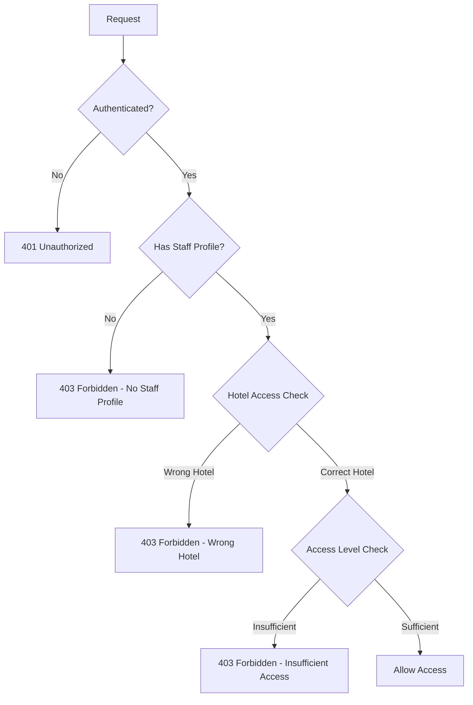
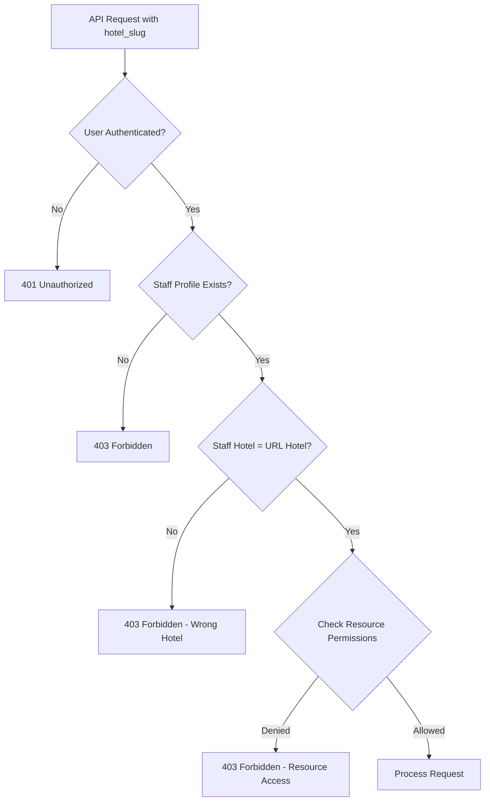
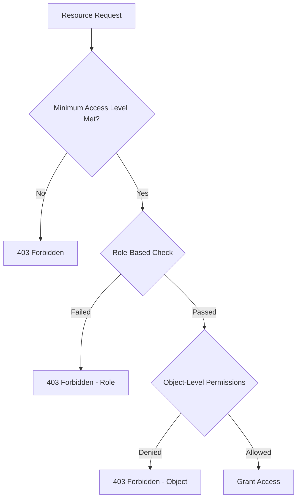

# HotelMate Backend - Permission System Complete Flow

## Overview

The HotelMate Backend implements a multi-layered permission system that controls access to resources based on user authentication, staff roles, access levels, and hotel scope. This document explains the complete flow of how permissions work across the system.

## Permission Architecture

### 1. Authentication Layer
- **Django User Authentication**: Base authentication using Django's built-in User model
- **Token Authentication**: REST Framework token-based authentication for API access
- **Staff Profile Linking**: Each authenticated user must have an associated `Staff` profile to access most endpoints
- **Hotel Middleware**: Subdomain-based hotel detection and assignment to request object
- **Custom Auth Backend**: Hotel-scoped authentication with superuser bypass

### 2. Permission Classes Hierarchy

#### Base Permission Classes

```python
# Located in: staff_chat/permissions.py
class IsStaffMember(BasePermission):
    """User must have a staff profile"""
    
class IsSameHotel(BasePermission):
    """User must belong to the same hotel as the resource"""
    
class IsConversationParticipant(BasePermission):
    """User must be participant in conversation"""
    
class CanManageConversation(BasePermission):
    """User can manage conversation (creator or manager role)"""
    
class IsMessageSender(BasePermission):
    """User must be the sender of the message"""
    
class CanDeleteMessage(BasePermission):
    """User can delete message (own messages or manager role)"""
```

#### Hotel-Specific Permissions

```python
# Located in: hotel/permissions.py
class IsSuperStaffAdminForHotel(BasePermission):
    """User must be super_staff_admin for the specific hotel"""
```

#### Superuser Permissions

```python
# Located in: staff/permissions_superuser.py
class IsSuperUser(BasePermission):
    """Django superuser access only"""
```

### 3. Mixin Classes for Permission Enforcement

#### Hotel Scoped ViewSet Mixin

```python
# Located in: common/mixins.py
class HotelScopedViewSetMixin:
    """Provides hotel-scoped functionality with automatic permissions"""
    permission_classes = [IsAuthenticated, IsStaffMember, IsSameHotel]
    
    def get_queryset(self):
        # Automatically filters to user's hotel
        
    def perform_create(self, serializer):
        # Ensures hotel is set correctly on creation
        
    def validate_hotel_access(self):
        # Validates URL hotel matches user's hotel
```

#### Attendance Hotel Scoped Mixin

```python
# Located in: common/mixins.py  
class AttendanceHotelScopedMixin(HotelScopedViewSetMixin):
    """Specialized mixin for attendance-related viewsets"""
    
    def perform_create(self, serializer):
        # Adds staff assignment for approval tracking
```

### 4. Middleware Layer

```python
# Located in: hotel/middleware.py
class HotelMiddleware:
    """Subdomain-based hotel detection and assignment"""
    
    def __call__(self, request):
        # Extracts hotel from subdomain and assigns to request.hotel
```

### 5. Authentication Backend

```python
# Located in: hotel/auth_backends.py
class HotelSubdomainBackend(ModelBackend):
    """Hotel-scoped authentication with superuser bypass"""
    
    def authenticate(self, request, username=None, password=None, **kwargs):
        # Validates user belongs to request.hotel
        # Allows superuser bypass
```

## Staff Access Levels

### 1. Access Level Hierarchy

```python
ACCESS_LEVEL_CHOICES = [
    ('regular_staff', 'Regular Staff'),      # Basic staff access
    ('staff_admin', 'Staff Admin'),          # Hotel management access
    ('super_staff_admin', 'Super Staff Admin'), # Full hotel control
]
```

### 2. Access Level Permissions

#### Regular Staff (`regular_staff`)
- ✅ Basic hotel operations
- ✅ Own profile management
- ✅ Chat/messaging
- ✅ Attendance logging
- ❌ Staff management
- ❌ Hotel settings
- ❌ Navigation permissions

#### Staff Admin (`staff_admin`)
- ✅ All regular staff permissions
- ✅ Generate registration codes
- ✅ Create staff profiles
- ✅ Basic hotel management
- ❌ Navigation permission management
- ❌ Super admin features

#### Super Staff Admin (`super_staff_admin`)
- ✅ All staff admin permissions
- ✅ Navigation permission management
- ✅ Hotel access configuration
- ✅ Full hotel control
- ✅ Public page builder access

#### Django Superuser (`is_superuser=True`)
- ✅ All permissions across all hotels
- ✅ Global navigation item management
- ✅ System-wide administration
- ✅ Cross-hotel operations

## Role-Based Permissions

### 1. Role System

```python
# Common roles in the system:
- manager      # Hotel management role
- admin        # Administrative role
- reception    # Front desk operations
- kitchen      # Kitchen staff
- maintenance  # Maintenance crew
- porter       # Porter services
- housekeeping # Housekeeping staff
```

### 2. Role-Based Access Control

```python
# Example: Manager/Admin role permissions
if staff.role and staff.role.slug in ['manager', 'admin']:
    return True  # Can manage conversations, delete messages, etc.
```

## Permission Flow Diagrams

### 1. Authentication Flow



### 2. Hotel Scoped Permission Flow



### 3. Access Level Permission Flow



## Specific Permission Implementations

### 1. Staff Management Endpoints

```python
# Creating staff profiles
@api_view(['POST'])
@permission_classes([IsAuthenticated])
def create_staff_from_user(request, hotel_slug):
    # Check: User is staff member of the hotel
    requesting_staff = Staff.objects.get(user=request.user)
    if requesting_staff.hotel.slug != hotel_slug:
        return 403  # Wrong hotel
```

### 2. Navigation Permissions

```python
# Managing navigation permissions
class StaffNavigationPermissionsView(APIView):
    permission_classes = [IsAuthenticated]
    
    def put(self, request, staff_id):
        # Only super_staff_admin can manage navigation
        if requesting_staff.access_level != 'super_staff_admin':
            return 403
```

### 3. Registration Code Generation

```python
# Generating registration packages
class GenerateRegistrationPackageAPIView(APIView):
    def post(self, request):
        staff = request.user.staff_profile
        # Must be staff_admin or super_staff_admin
        if staff.access_level not in ['staff_admin', 'super_staff_admin']:
            return 403
```

### 4. Room Booking Management

```python
# Staff booking operations
class StaffBookingsListView(APIView):
    def get_permissions(self):
        from staff_chat.permissions import IsStaffMember, IsSameHotel
        return [IsAuthenticated(), IsStaffMember(), IsSameHotel()]
```

### 5. Chat System Permissions

```python
# Message management
class CanDeleteMessage(BasePermission):
    def has_object_permission(self, request, view, obj):
        staff = request.user.staff_profile
        hard_delete = request.query_params.get('hard_delete') == 'true'
        
        if hard_delete:
            # Only managers/admins can hard delete
            if staff.role and staff.role.slug in ['manager', 'admin']:
                return True
            return obj.sender.id == staff.id
        else:
            # Soft delete - own messages only
            return obj.sender.id == staff.id
```

## Permission Matrix

### Endpoint Access Matrix

| Endpoint Category | Regular Staff | Staff Admin | Super Staff Admin | Django Superuser |
|------------------|---------------|-------------|------------------|------------------|
| **Authentication** |
| Login/Logout | ✅ | ✅ | ✅ | ✅ |
| Profile Management | ✅ (Own) | ✅ (Own) | ✅ (Own) | ✅ (All) |
| **Staff Management** |
| View Staff | ✅ (Hotel) | ✅ (Hotel) | ✅ (Hotel) | ✅ (All) |
| Create Staff | ❌ | ✅ (Hotel) | ✅ (Hotel) | ✅ (All) |
| Registration Codes | ❌ | ✅ (Generate) | ✅ (Generate) | ✅ (All) |
| Navigation Permissions | ❌ | ❌ | ✅ (Hotel) | ✅ (All) |
| **Hotel Management** |
| Hotel Settings | ❌ | ❌ | ✅ | ✅ |
| Public Page Builder | ❌ | ❌ | ✅ | ✅ |
| Access Configuration | ❌ | ❌ | ✅ | ✅ |
| **Operations** |
| Room Bookings | ✅ (View) | ✅ (Manage) | ✅ (Manage) | ✅ (All) |
| Chat/Messages | ✅ (Participate) | ✅ (Manage) | ✅ (Manage) | ✅ (All) |
| Attendance | ✅ (Own) | ✅ (Hotel) | ✅ (Hotel) | ✅ (All) |
| Stock Management | ✅ (Basic) | ✅ (Manage) | ✅ (Manage) | ✅ (All) |

## Permission Enforcement Points

### 1. View-Level Permissions

```python
# Applied at the view class level
class StaffViewSet(viewsets.ModelViewSet):
    permission_classes = [IsAuthenticated, IsStaffMember, IsSameHotel]
```

### 2. Method-Level Permissions

```python
# Applied to specific methods
@action(detail=False, methods=['post'], permission_classes=[IsSuperUser])
def admin_only_action(self, request):
    pass
```

### 3. Object-Level Permissions

```python
# Applied to specific objects
def has_object_permission(self, request, view, obj):
    return obj.hotel == request.user.staff_profile.hotel
```

### 4. Custom Permission Logic

```python
# Custom validation in view methods
def get_permissions(self):
    if self.action == 'create':
        return [IsAuthenticated(), IsStaffMember()]
    return [IsAuthenticated()]
```

### 5. Mixin-Based Permissions

```python
# Using mixins for consistent permission enforcement
class RosterPeriodViewSet(AttendanceHotelScopedMixin, viewsets.ModelViewSet):
    # Inherits permissions: [IsAuthenticated, IsStaffMember, IsSameHotel]
    # Inherits hotel scoping and validation
```

### 6. Decorator-Based Permissions

```python
# Function-based view permissions
@api_view(['POST'])
@permission_classes([IsAuthenticated, IsStaffMember, IsSameHotel])
def create_conversation(request, hotel_slug):
    # Staff chat conversation creation
```

### 7. Serializer-Level Validation

```python
# Field-level permissions in serializers
class StaffSerializer(serializers.ModelSerializer):
    access_level = serializers.ChoiceField(choices=Staff.ACCESS_LEVEL_CHOICES)
    
    def validate_access_level(self, value):
        # Only certain users can set high access levels
        requesting_staff = self.context['request'].user.staff_profile
        if value == 'super_staff_admin' and requesting_staff.access_level != 'super_staff_admin':
            raise serializers.ValidationError("Insufficient permissions")
        return value
```

### 8. Model-Level Constraints

```python
# Model field validation
class Staff(models.Model):
    access_level = models.CharField(
        max_length=20,
        choices=ACCESS_LEVEL_CHOICES,
        default='regular_staff'
    )
    hotel = models.ForeignKey('hotel.Hotel', on_delete=models.CASCADE)
    # Hotel is required - ensures all staff belong to a hotel
```

### 9. URL-Level Scoping

```python
# Hotel-scoped URL patterns
urlpatterns = [
    path('staff/<slug:hotel_slug>/roster/', include('attendance.urls')),
    path('staff/<slug:hotel_slug>/chat/', include('staff_chat.urls')),
    # hotel_slug parameter enforces hotel context
]
```

### 10. Queryset Filtering

```python
# Automatic hotel filtering in get_queryset
def get_queryset(self):
    staff = self.request.user.staff_profile
    return MyModel.objects.filter(hotel=staff.hotel)
```

## Security Considerations

### 1. Hotel Isolation

- **URL-based Hotel Scoping**: All hotel-specific endpoints include `hotel_slug` parameter
- **Staff-Hotel Binding**: Each staff member belongs to exactly one hotel
- **Cross-Hotel Prevention**: Automatic checks prevent access to other hotels' data

### 2. Token Security

- **Token Rotation**: Tokens can be regenerated
- **Session Management**: Token-based stateless authentication
- **Logout Handling**: Token cleanup on logout

### 3. Permission Validation

- **Multiple Check Points**: Permissions validated at view, method, and object levels
- **Fail-Safe Design**: Default deny approach
- **Audit Trail**: Permission checks logged for security monitoring

## Common Permission Patterns

### 1. Hotel-Scoped Resource Access

```python
def get_permissions(self):
    return [IsAuthenticated(), IsStaffMember(), IsSameHotel()]

def get_queryset(self):
    staff = self.request.user.staff_profile
    return MyModel.objects.filter(hotel=staff.hotel)
```

### 2. Access Level Gating

```python
def check_access_level(self, request, required_level):
    staff = request.user.staff_profile
    access_levels = ['regular_staff', 'staff_admin', 'super_staff_admin']
    user_level_index = access_levels.index(staff.access_level)
    required_level_index = access_levels.index(required_level)
    return user_level_index >= required_level_index
```

### 3. Role-Based Conditional Access

```python
def has_management_role(self, staff):
    return staff.role and staff.role.slug in ['manager', 'admin']

def can_manage_resource(self, staff, resource):
    return (
        resource.created_by == staff or
        self.has_management_role(staff) or
        staff.access_level == 'super_staff_admin'
    )
```

## Error Handling

### 1. Permission Error Responses

```python
# Standard HTTP status codes for permission errors
401 Unauthorized    # Not authenticated
403 Forbidden      # Authenticated but not authorized
404 Not Found      # Resource doesn't exist or no access (security)
```

### 2. Error Messages

```python
# User-friendly error messages
{
    "detail": "You must be a staff member to access this resource.",
    "error_code": "staff_required",
    "status": 403
}
```

### 3. Logging and Monitoring

```python
# Permission failures should be logged for security monitoring
logger.warning(f"Permission denied: {request.user} attempted {request.method} {request.path}")
```

## Best Practices

### 1. Principle of Least Privilege
- Grant minimum necessary permissions
- Regular review of access levels
- Time-bound elevated access where applicable

### 2. Defense in Depth
- Multiple permission layers
- View-level and object-level checks
- Input validation and sanitization

### 3. Consistent Permission Patterns
- Standardized permission classes
- Consistent naming conventions
- Reusable permission logic

### 4. Documentation and Testing
- Document all permission requirements
- Comprehensive permission testing
- Regular security audits

## Complete Permission Component Breakdown

### Models with Permission-Related Fields

```python
# staff/models.py
class Staff(models.Model):
    access_level = models.CharField(choices=ACCESS_LEVEL_CHOICES)
    hotel = models.ForeignKey('hotel.Hotel')  # Hotel isolation
    role = models.ForeignKey(Role)  # Role-based permissions
    department = models.ForeignKey(Department)  # Department scoping
    allowed_navigation_items = models.ManyToManyField(NavigationItem)

# stock_tracker/models.py  
class PeriodReopenPermission(models.Model):
    staff = models.ForeignKey(Staff)
    hotel = models.ForeignKey(Hotel)
    can_grant_to_others = models.BooleanField()  # Permission delegation

# User model extensions
class User(AbstractUser):
    is_staff = models.BooleanField()  # Django admin access
    is_superuser = models.BooleanField()  # Full system access
```

### Views with Permission Enforcement

```python
# All ViewSets and APIViews implement permissions via:
- permission_classes at class level
- get_permissions() method for dynamic permissions
- Mixin inheritance (HotelScopedViewSetMixin, AttendanceHotelScopedMixin)
- Custom validation in view methods
- @permission_classes decorator for function-based views

# Examples across modules:
- staff/views.py: Staff management, navigation permissions
- hotel/staff_views.py: Hotel content management  
- attendance/views.py: Roster and attendance operations
- chat/views.py: Guest chat system
- staff_chat/views_*.py: Staff chat system
- stock_tracker/views.py: Stock management permissions
```

### URLs with Permission Context

```python
# Hotel-scoped URL patterns provide context:
- /staff/{hotel_slug}/... - Staff operations scoped to hotel
- /api/attendance/{hotel_slug}/... - Attendance scoped to hotel  
- /api/hotel/{hotel_slug}/... - Hotel management scoped to hotel
- /public/{hotel_slug}/... - Public APIs with hotel context

# Permission validation happens at multiple URL levels:
1. Middleware extracts hotel from subdomain
2. URL parameter provides hotel_slug for scoping
3. View permissions validate user access to hotel
```

### Serializers with Permission Logic

```python
# staff/serializers.py
class StaffSerializer(serializers.ModelSerializer):
    - access_level validation based on requesting user
    - allowed_navs computed based on permissions
    - hotel assignment and validation
    
class StaffLoginOutputSerializer(serializers.Serializer):
    - Includes access_level, allowed_navs, role information
    - Validates permission consistency
    
# stock_tracker/stock_serializers.py
class PeriodReopenPermissionSerializer(serializers.ModelSerializer):
    - Manages stock period reopen permissions
    
# All serializers implement field-level permission validation
```

### Filters and Querysets with Security

```python
# attendance/filters.py
class StaffRosterFilter(django_filters.FilterSet):
    hotel_slug = django_filters.CharFilter()  # Hotel scoping

# All get_queryset() methods filter by:
- Hotel (via staff.hotel)
- Department (when applicable)
- User permissions (access_level, role)
- Object ownership (created_by, assigned_to)
```

### Permission Files by Module

```
├── common/
│   └── mixins.py                    # HotelScopedViewSetMixin, AttendanceHotelScopedMixin
├── hotel/
│   ├── auth_backends.py             # HotelSubdomainBackend
│   ├── middleware.py                # HotelMiddleware
│   └── permissions.py               # IsSuperStaffAdminForHotel
├── staff/
│   ├── permissions_superuser.py     # IsSuperUser
│   └── views.py                     # Staff management permissions
├── staff_chat/
│   └── permissions.py               # IsStaffMember, IsSameHotel, etc.
├── attendance/
│   ├── views.py                     # Attendance permission mixins
│   └── face_views.py                # Face recognition permissions
└── stock_tracker/
    ├── views.py                     # Stock management permissions
    └── models.py                    # PeriodReopenPermission model
```

### Database-Level Security

```python
# Foreign key constraints ensure data integrity:
- Staff.hotel (required) - No staff without hotel
- All hotel-scoped models have hotel foreign key
- Cascade deletes maintain consistency

# Model validation:
- ACCESS_LEVEL_CHOICES enforced at DB level
- Unique constraints on user-hotel relationships
- Index optimization for permission queries
```

### Admin Interface Permissions

```python
# Django admin permissions controlled by:
- is_staff flag for admin access
- is_superuser flag for full admin access
- Custom admin classes with permission checks
- Hotel-scoped admin queries where applicable
```

## Implementation Checklist

When implementing new endpoints:

### Required Permission Components:
- [ ] **View Level**: Define permission_classes or use mixin
- [ ] **Hotel Scoping**: Use HotelScopedViewSetMixin if hotel-specific
- [ ] **Access Level**: Check staff.access_level if needed
- [ ] **Role-Based**: Validate staff.role if applicable  
- [ ] **Queryset Filtering**: Filter by hotel and permissions
- [ ] **Serializer Validation**: Add field-level permission checks
- [ ] **URL Pattern**: Include hotel_slug parameter if needed
- [ ] **Error Handling**: Return appropriate 401/403/404 responses

### Testing Requirements:
- [ ] Unauthenticated access denied (401)
- [ ] Cross-hotel access denied (403) 
- [ ] Insufficient access level denied (403)
- [ ] Same hotel access allowed (200)
- [ ] Superuser bypass works
- [ ] Object-level permissions enforced

### Security Validation:
- [ ] Hotel isolation maintained
- [ ] No permission elevation possible
- [ ] Audit logging implemented
- [ ] Rate limiting where applicable
- [ ] Input validation and sanitization

This comprehensive permission system provides defense-in-depth security with multiple layers of validation, ensuring robust access control across all components of the HotelMate Backend application.