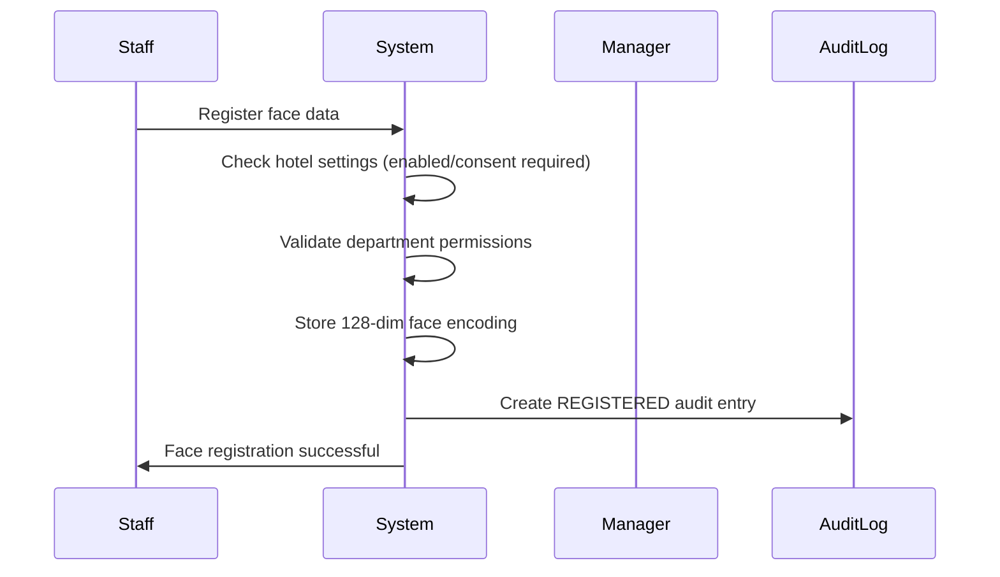
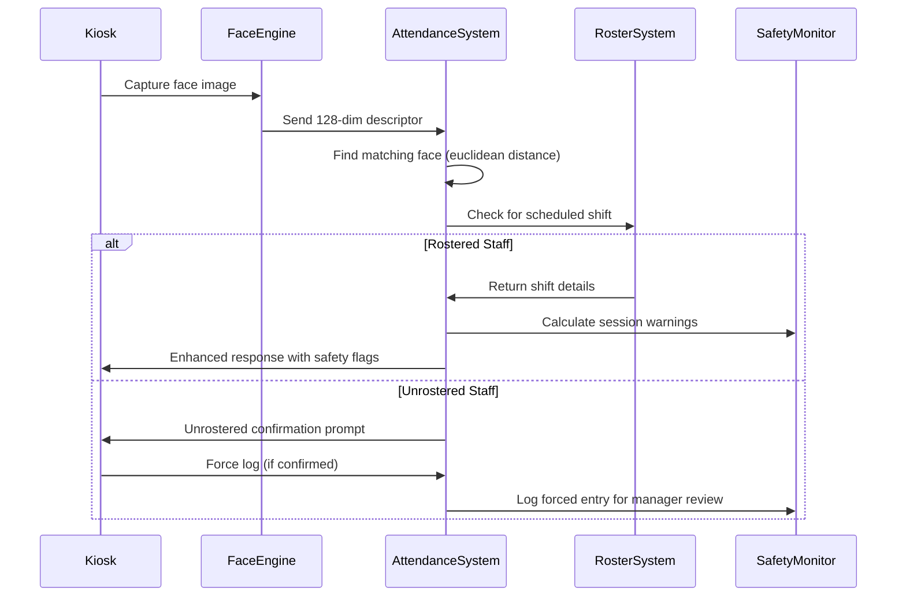
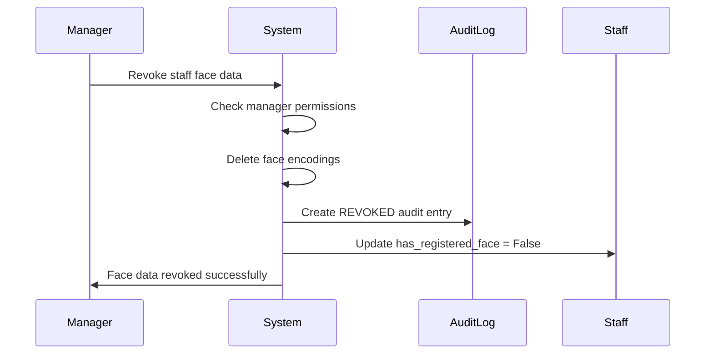

# Attendance & Face Recognition System - Technical Overview

## System Architecture

The HotelMate attendance and face recognition system provides a comprehensive solution for hotel staff time tracking with biometric authentication, safety monitoring, and robust audit trails.

### Core Components

```
┌─────────────────────────────────────────────────────────────────┐
│                    HotelMate Attendance System                   │
├─────────────────────────────────────────────────────────────────┤
│  Phase 1: Face Lifecycle Control                               │
│  ├── FaceAuditLog Model (audit trail)                          │
│  ├── Face Registration/Revocation Endpoints                    │
│  └── Manager Controls for Face Data                            │
├─────────────────────────────────────────────────────────────────┤
│  Phase 2: Kiosk UX Safety Support                              │
│  ├── Enhanced Clock-In Response with Safety Flags             │
│  ├── Session Duration Warnings (6h/10h/12h thresholds)        │
│  └── Force-Log Capability for Unrostered Staff                │
├─────────────────────────────────────────────────────────────────┤
│  Phase 3: Config & Permissions System                          │
│  ├── Hotel-Level Face Attendance Settings                     │
│  ├── Department-Based Access Control                          │
│  └── Consent Logging & Privacy Controls                       │
├─────────────────────────────────────────────────────────────────┤
│  Phase 4: Tests & Edge-Case Coverage                           │
│  ├── Face Lifecycle Tests                                     │
│  ├── Clock-In Edge Case Tests                                 │
│  └── Configuration Enforcement Tests                          │
└─────────────────────────────────────────────────────────────────┘
```

## How Face Attendance Works End-to-End

### 1. Staff Onboarding Flow



### 2. Daily Clock-In/Out Flow



### 3. Manager Control Flow



## API Endpoints

### Face Management Endpoints

#### Register Face
```http
POST /api/staff/hotel/{hotel_slug}/attendance/clock-logs/register-face/
```

**Request Body:**
```json
{
  "descriptor": [128-dimensional array],
  "consent_given": true
}
```

**Response:**
```json
{
  "message": "Face descriptor registered.",
  "audit_log_id": 123
}
```

**Error Codes:**
- `FACE_DISABLED_FOR_HOTEL`: Face attendance not enabled
- `FACE_DISABLED_FOR_DEPARTMENT`: Department not allowed
- `CONSENT_REQUIRED`: Explicit consent needed
- `SELF_REGISTRATION_DISABLED`: Staff cannot register own face

#### Revoke Face
```http
DELETE /api/staff/hotel/{hotel_slug}/attendance/clock-logs/revoke-face/{staff_id}/
```

**Request Body:**
```json
{
  "reason": "Staff departure"
}
```

**Response:**
```json
{
  "message": "Face data revoked for John Doe.",
  "staff_id": 123,
  "has_registered_face": false
}
```

#### Face Clock-In/Out (Enhanced)
```http
POST /api/staff/hotel/{hotel_slug}/attendance/clock-logs/face-clock-in/
```

**Request Body:**
```json
{
  "descriptor": [128-dimensional array],
  "force_log": false,
  "force_reason": "Emergency coverage needed"
}
```

**Enhanced Response:**
```json
{
  "message": "Clock-in successful for John Doe",
  "staff_id": 123,
  "staff_name": "John Doe",
  "action": "CLOCK_IN",
  "is_rostered": true,
  "shift_info": {
    "id": 456,
    "date": "2025-11-30",
    "start_time": "09:00:00",
    "end_time": "17:00:00",
    "location": "Front Desk",
    "department": "Reception"
  },
  "session_duration_hours": 0,
  "needs_break_warning": false,
  "needs_long_session_warning": false,
  "needs_hard_stop_warning": false,
  "overtime_threshold_reached": false,
  "should_clock_out": false,
  "log": { /* ClockLog serializer data */ }
}
```

**For Clock-Out (with long session):**
```json
{
  "message": "Clock-out successful for John Doe",
  "action": "CLOCK_OUT", 
  "session_duration_hours": 8.5,
  "needs_break_warning": true,
  "needs_long_session_warning": false,
  "needs_hard_stop_warning": false
}
```

**For Unrostered Staff:**
```json
{
  "action": "unrostered_detected",
  "message": "No scheduled shift found for John. Please confirm if you want to clock in anyway.",
  "staff": {
    "id": 123,
    "name": "John Doe",
    "department": "Reception"
  },
  "requires_confirmation": true,
  "force_log_available": true,
  "confirmation_endpoint": "/api/staff/hotel/{hotel_slug}/attendance/clock-logs/unrostered-confirm/",
  "force_log_endpoint": "/api/staff/hotel/{hotel_slug}/attendance/clock-logs/force-log/"
}
```

#### Force Log Unrostered
```http
POST /api/staff/hotel/{hotel_slug}/attendance/clock-logs/force-log/
```

**Request Body:**
```json
{
  "staff_id": 123,
  "reason": "Emergency coverage - manager approved via phone"
}
```

#### Face Audit Logs
```http
GET /api/staff/hotel/{hotel_slug}/attendance/clock-logs/face-audit-logs/
```

**Query Parameters:**
- `staff_id`: Filter by specific staff member
- `action`: Filter by action type (REGISTERED, REVOKED, RE_REGISTERED, FORCED_CLOCK_IN)

**Response:**
```json
[
  {
    "id": 1,
    "hotel": "grand-hotel",
    "staff": 123,
    "staff_name": "John Doe",
    "action": "REGISTERED",
    "performed_by": 123,
    "performed_by_name": "John Doe",
    "reason": null,
    "consent_given": true,
    "created_at": "2025-11-30T10:00:00Z"
  },
  {
    "id": 2,
    "hotel": "grand-hotel",
    "staff": 123,
    "staff_name": "John Doe", 
    "action": "REVOKED",
    "performed_by": 124,
    "performed_by_name": "Jane Manager",
    "reason": "Staff departure",
    "consent_given": true,
    "created_at": "2025-12-01T14:30:00Z"
  }
]
```

## Configuration System

### Hotel-Level Settings

Face attendance is configured through the `AttendanceSettings` model:

```python
# In hotel admin or via API
{
  "face_attendance_enabled": true,
  "face_attendance_min_confidence": 0.85,  # 85% confidence threshold
  "require_face_consent": true,
  "allow_face_self_registration": true,
  "face_data_retention_days": 365,
  "face_attendance_departments": [1, 2, 3]  # Department IDs allowed
}
```

### Safety Warning Thresholds

```python
{
  "break_warning_hours": 6.0,      # Suggest break after 6 hours
  "overtime_warning_hours": 10.0,  # Overtime warning at 10 hours  
  "hard_limit_hours": 12.0,        # Force action at 12 hours
  "enforce_limits": true
}
```

## Data Models

### FaceAuditLog
```python
class FaceAuditLog(models.Model):
    hotel = ForeignKey(Hotel)
    staff = ForeignKey(Staff)
    action = CharField(choices=['REGISTERED', 'REVOKED', 'RE_REGISTERED', 'FORCED_CLOCK_IN'])
    performed_by = ForeignKey(Staff, null=True)  # Who performed the action
    reason = TextField(blank=True)
    consent_given = BooleanField(default=True)
    client_ip = GenericIPAddressField(null=True)
    user_agent = TextField(blank=True)
    created_at = DateTimeField(auto_now_add=True)
```

### Enhanced ClockLog
```python
class ClockLog(models.Model):
    # ... existing fields ...
    verified_by_face = BooleanField(default=True)
    is_unrostered = BooleanField(default=False) 
    is_approved = BooleanField(default=False)
    roster_shift = ForeignKey(StaffRoster, null=True)
    long_session_ack_mode = CharField(...)  # 'stay_clocked_in', 'clocked_out'
```

## Security & Privacy

### Data Protection
- Face encodings stored as 128-dimensional arrays (not images)
- Configurable data retention periods
- Explicit consent tracking with audit trail
- IP address and user agent logging for security

### Access Control
- Hotel-level enable/disable controls
- Department-based restrictions  
- Manager-only revocation capabilities
- Self-registration permissions

### GDPR Compliance
- Right to withdraw consent (face revocation)
- Right to data portability (audit logs)
- Right to erasure (configurable retention)
- Lawful basis tracking (consent logs)

## Error Codes & Handling

### Face Recognition Errors
- `FACE_NOT_RECOGNIZED`: No matching face found
- `FACE_CONFIDENCE_TOO_LOW`: Recognition below threshold
- `FACE_DISABLED_FOR_HOTEL`: Feature disabled
- `FACE_DISABLED_FOR_DEPARTMENT`: Department restricted

### Registration Errors
- `CONSENT_REQUIRED`: Explicit consent needed
- `SELF_REGISTRATION_DISABLED`: Admin registration only
- `INVALID_FACE_DATA`: Malformed 128-dim array

### Clock-In Errors  
- `NOT_ROSTERED`: No scheduled shift (with force_log option)
- `ALREADY_CLOCKED_IN`: Staff already has active session
- `SESSION_TOO_LONG`: Hard limit exceeded, requires action

## Integration Points

### Frontend Kiosk Requirements
1. **Face Capture**: Generate 128-dimensional face descriptors
2. **Safety UI**: Display break/overtime warnings with escalating urgency
3. **Confirmation Flows**: Handle unrostered staff with force-log option
4. **Real-time Updates**: WebSocket integration for live status updates

### Manager Dashboard Integration
1. **Audit Trail View**: Face lifecycle events with filtering
2. **Approval Queue**: Unrostered/forced clock-ins requiring review
3. **Configuration Panel**: Hotel-level face attendance settings
4. **Safety Monitoring**: Long session alerts and intervention tools

### PMS System Integration  
1. **Roster Sync**: Link clock logs to planned shifts
2. **Department Data**: Sync department restrictions
3. **Staff Lifecycle**: Handle departures and face data cleanup

## Performance Considerations

### Face Recognition Performance
- Euclidean distance calculation: O(n) where n = number of registered faces
- Typical hotel: 50-200 staff = sub-millisecond recognition
- Confidence threshold tuning: balance security vs. usability

### Database Optimization
- Index on `(hotel, staff, created_at)` for audit logs
- Index on `(hotel, staff, time_in__date, time_out)` for clock logs  
- Partition audit logs by month for large hotels

### Caching Strategy
- Cache hotel attendance settings (Redis)
- Cache department restrictions per hotel
- Cache staff face data for active sessions

## Monitoring & Alerts

### System Health Metrics
- Face recognition success rate
- Average confidence scores
- Clock-in/out response times
- Audit log growth rates

### Business Metrics  
- Attendance compliance rates
- Overtime hours per department
- Unrostered clock-in frequency
- Face registration adoption rates

### Alert Conditions
- Multiple failed face recognitions (potential security issue)
- Unusually high unrostered activity (scheduling problems)
- Long sessions exceeding hard limits (safety concern)
- Face data revocations (compliance tracking)

This technical overview provides the foundation for understanding the complete face attendance system architecture, from basic clock-in operations to advanced safety monitoring and compliance features.